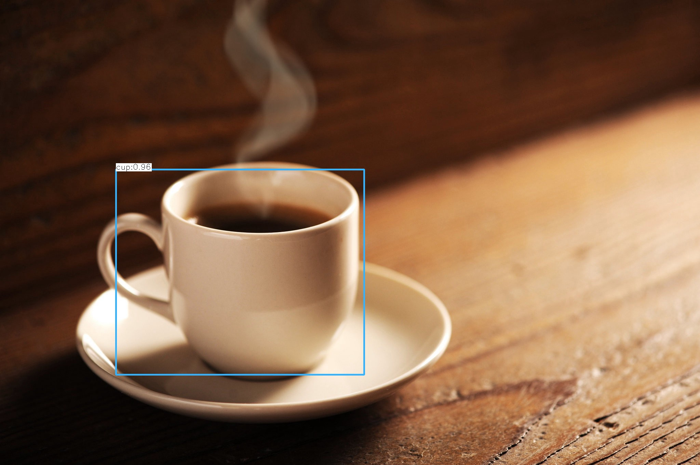

# CPPND: Capstone Project

## Object Detection in C++ with OpenCV

## Overview
This is the capstone project for the [Udacity C++ Nanodegree Program](https://www.udacity.com/course/c-plus-plus-nanodegree--nd213). I implemented an object detection model using OpenCV. The program read an image file and then performs object detection on it. Finally, it gives an output image which is the original image with bounding boxes over the detected objects in the image. The bounding boxes also have an overlay of the detected class and the confidence value. This program is modular in the sense that it can be used for various Deep Neural Network Models (but it has only been tested with [yolov3](https://pjreddie.com/darknet/yolo/) and [yolov3-tiny](https://pjreddie.com/darknet/yolo/)). By default, the scripts will load the yolov3-tiny model (it needs less computation compared to other yolo models at the expense of performance). The program is run through the command line and takes in various options and input parameters.

## File Structure

This repository contains:
- `data/` : Contains sample input image data that may be used for the program.

- `include/` : Constains the header files `buffer.h`, `input.h`, `output.h`, `object_detector.h` files.

- `model/` : Constains a script `getModel.sh` to download and generate the model weight, configuration and class names files for the yolov3-tiny DNN model. 

- `output/` : The output image file of the program will be generated and saved here.

- `src/` : Source. Constains the `main.cpp`, `input.cpp`, `output.cpp`, `object_detector.cpp` files.

- `CMakeLists.txt` : cmake configuration file

- `README.md` : This file

## Dependencies for Running Locally
* cmake >= 3.11.3
  * All OSes: [click here for installation instructions](https://cmake.org/install/)
* make >= 4.1 (Linux, Mac), 3.81 (Windows)
  * Linux: make is installed by default on most Linux distros
  * Mac: [install Xcode command line tools to get make](https://developer.apple.com/xcode/features/)
  * Windows: [Click here for installation instructions](http://gnuwin32.sourceforge.net/packages/make.htm)
* OpenCV >= 4.1.x
  * The OpenCV 4.1.0 source code can be found [here](https://github.com/opencv/opencv/master)
* gcc/g++ >= 5.4
  * Linux: gcc / g++ is installed by default on most Linux distros
  * Mac: same deal as make - [install Xcode command line tools](https://developer.apple.com/xcode/features/)
  * Windows: recommend using [MinGW](http://www.mingw.org/)

  **! This repository has been successfully built and tested on Ubuntu 18.08 with OpenCV 4.1 running C++14.**

## Build Instructions

1. Clone this repo using `git clone https://github.com/avnishsachar/CppND-Program-Capstone-Project.git`.
2. Enter the root directory of the repository using `cd CppND-Program-Capstone-Project`.
3. `cd model`
4. `sudo chmod a+x getModel.sh`
5. `./getModel.sh`
5. `cd ..`
3. `mkdir build && cd build`
4. `cmake ..`
5. `make`

The executable(`objectdetector`) is created in the current directory(`build`).

## Run

In `build` directory, run the executable like below:

`./objectdetector [options] --image=<image-file>`

- `<image-file>` is the **absolute file path with no preceding space** to the image you want to input.
- Options:
 - `-c` : specifies the *confidence threshold* between 0 and 1.0. If omitted, default value is 0.5.
 - `-n` : specifies the threshold used for *Non-max Suppression* between 0 and 1.0. If omitted, default value is 0.4.
 - `-h` `-?` `--help` `--usage`: Shows usage.

 #### Example

`./objectdetector --input=/home/avnish/CppND-Capstone-Project/data/coffee.jpg`

## Reference

[1] https://github.com/opencv/opencv/blob/master/samples/dnn/object_detection.cpp